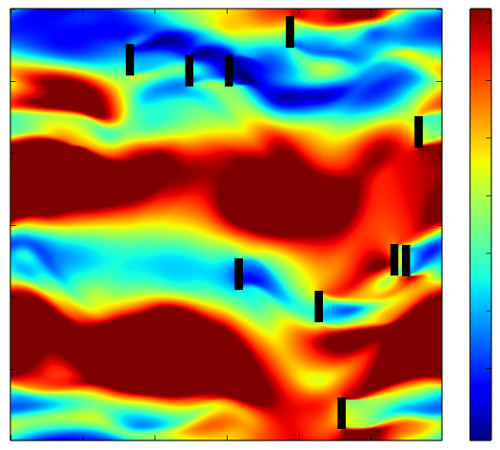

# 2D CFD 
## Solves the incompressible Euler equations.

The code solves the incompressible Euler equations. The code closely follows the derivation here:
http://www-math.mit.edu/cse/codes/mit18086_navierstokes.pdf

See an example image from the simulation here:



## Running the code.

Running the code is as simple as:

```
# get the repository
git clone https://github.com/sAlexander/cfd.git

# compile all of the fortran
cd cfd/src
make

# run the code
./cfd
```

## Scripting with the code

A sample script has been added as `python/scripted.py`. This simple script will run a simple genetic algorithm in parallel -- parameters are explained in the file.

To run the script, the following will suffice:

```
# get the repository
git clone https://github.com/sAlexander/cfd.git

# compile all of the fortran
cd cfd/src
make

# move back up to the root directory
cd ..

# run the script
python python/scripted.py
```


